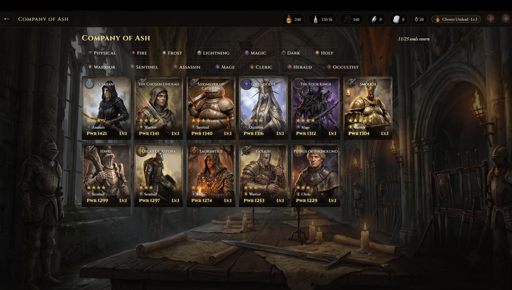
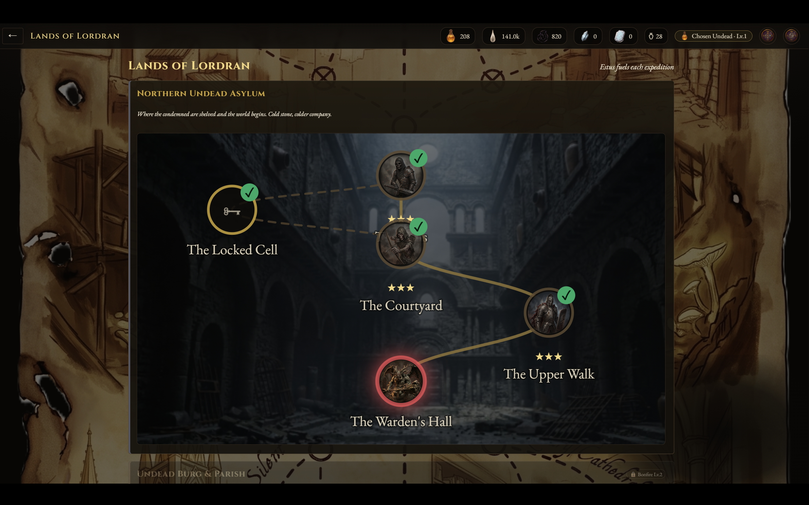
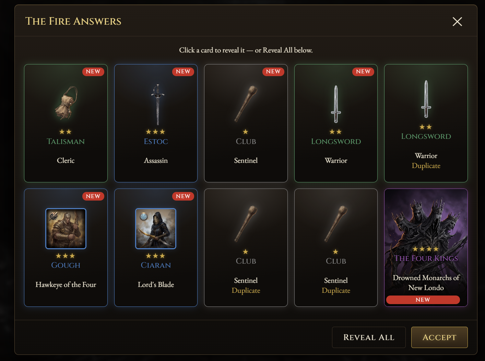
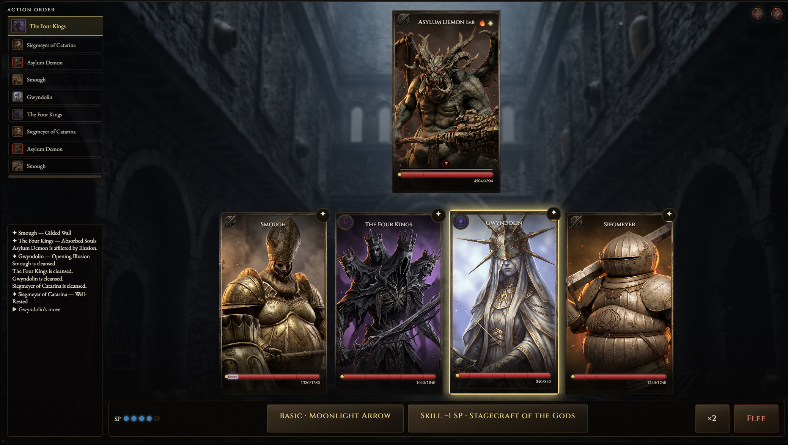

# Ashen Tactics: Embers of Lordran

A free, turn-based gacha RPG set in the ashen ruins of Lordran. Summon warriors pulled from across a ruined kingdom, gear them with weapons and relics, and fight your way through five regions toward the First Flame.

It's a Dark Souls fan project in setting only: character and place **names** are drawn from Dark Souls, but every line of dialogue, every piece of art, and every game system is original work — nothing is copied from the source games.

- **25 warriors** to summon and build, from 3★ to 5★
- **8 covenant-themed relic sets**, each with 2/4-piece set bonuses
- **5 regions of Lordran**, each ending in a multi-phase boss
- Turn-based combat with elemental weaknesses, a "toughness break" system, and an interruptible ultimate meter
- A full gacha loop — pity counters, 50/50 banners, a bonfire-ignition summon ritual
- Runs as a browser build **and** a native Windows/macOS/Linux desktop app

## Screenshots

| | |
|---|---|
|  |  |
| *Company of Ash — the roster* | *Lands of Lordran — the expedition map* |
|  |  |
| *Summoning Rituals — the gacha* | *Turn-based battle* |

## How it was built

The game is a single-page vanilla JavaScript app — no framework, no bundler, no build step for the web layer. Every source file is a self-contained IIFE that attaches its piece of the game to one global namespace (`window.DS`), loaded in a fixed order straight off `index.html`.

That "no framework" choice only works at this scale because the project was built **contract-first**: before any feature code was written, a single architecture document (`CONTRACT.md`) pinned down every data schema (characters, weapons, relics, enemies, stages, banners...), every engine API (battle math, AI, progression, inventory, gacha odds and pity), and every UI screen's responsibilities. With that shared interface locked, the character roster, the battle engine, the gacha system, and each UI screen could all be built independently — as long as each one honored the contract, the pieces slotted together without needing to touch each other's files.

A thin [Tauri](https://tauri.app) (Rust) shell then wraps that same web app to produce an installable native desktop build, so the exact same codebase ships both as a browser game and a downloadable app.

## Technologies used

**Game**
- Vanilla JavaScript (ES2020) — no frameworks, no bundler, no npm dependencies for gameplay code
- Vanilla CSS with a shared token file (`css/theme.css`) plus one stylesheet per screen
- Canvas 2D for battle VFX (particle bursts, floating damage numbers, ultimate cut-ins)
- `localStorage` for save data (no backend/server — everything is client-side)

**Desktop build**
- [Tauri 2](https://tauri.app) + Rust — packages the web app into a native Windows/macOS/Linux executable

**Marketing site** (`website/`)
- Static HTML/CSS/JS, Google Fonts (Cinzel, EB Garamond)

**Local dev tooling**
- A small PowerShell static file server for previewing the browser build with zero dependencies

## What AI (Claude) contributed

This project was built end-to-end with Claude Code, using a coordinator/subagent workflow rather than one long freeform session:

- **Architecture first.** Claude wrote `CONTRACT.md` — the schemas, engine APIs, and UI contracts described above — before implementing any feature, specifically so later work could be parallelized without pieces drifting out of sync.
- **Implementation.** All gameplay code was AI-written against that contract: the turn-based battle simulator (action-value timelines, elemental weaknesses, toughness break, status effects), the enemy AI, the leveling/ascension/trace progression math, the inventory and relic-substat rolling, and the gacha engine (rates, soft/hard pity, 50/50 guarantees).
- **Content.** All game data was AI-authored: 25 character kits with full ability kits, ~30 weapons, 8 relic sets, enemy movesets and multi-phase bosses across 5 regions, quest lines, mail, and events — including every line of original dialogue and lore, written specifically to avoid reusing text from the actual Dark Souls games.
- **UI.** Every screen (title, hub, map, battle, gacha ritual, character/inventory/crafting, quests) was built by Claude against the UI contract, including the battle VFX system and the gacha's bonfire-ignition summon animation.
- **Art direction.** Some hub and menu iconography was generated by describing each piece as a structured JSON prompt (subject, framing, lighting, brand constraints) and rendering it through Nano Banana Pro (Gemini 3 Pro Image), then hand-placed into the UI.

In short: the design contract, the engine, the content, and the UI are AI-generated; a human directed the process, made the creative/architectural calls, and reviewed the output.

## How to run it

### Play in a browser (fastest)

No installs required — it's static files.

```bash
powershell -ExecutionPolicy Bypass -File .claude/static-server.ps1 -Port 8791
```

Then open **http://localhost:8791**. (Any static file server works, e.g. `npx serve .`, if you'd rather not use PowerShell.)

### Run the desktop app

Requires [Node.js](https://nodejs.org) and the [Rust toolchain](https://www.rust-lang.org/tools/install) (Tauri's build requirement).

```bash
npm install
npm run dev      # launches a live desktop window
npm run build    # produces an installable build in src-tauri/target/release/bundle
```

## Play it live

> 🔗 *Add your deployed link here* — e.g. a GitHub Pages URL for the browser build, or an itch.io page with the desktop download.

## Disclaimer

Ashen Tactics: Embers of Lordran is an unofficial, non-commercial fan project. It is not affiliated with, endorsed by, or sponsored by FromSoftware or Bandai Namco. Dark Souls character and location names are used as homage; all artwork, prose, and game systems are original creations.
